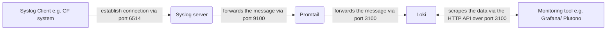

# Example of the cert creation for the Loki/ Promtail/ Syslog setup

## Ca Certificates

### Loki

### Promtail

### Syslog

## Server Certificates

### Loki

### Promtail

### Syslog

## Client Certificates

### Loki

### Promtail

### Syslog

## Communication flow of the certificates and network routes

