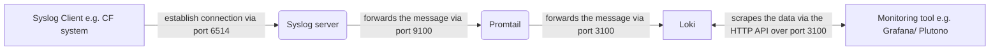

# Example of the cert creation for the Loki/ Promtail/ Syslog setup

## Creation

Please execute the following script `bash create-tls-certs.sh` to create all necessary certificates for the complete setup of all related components.

## Adaptation

Please adjust the configuration files inside the [config](./config) folder and adapt the corresponding values for the req_distinguished_names and subjectAltNames based on your organisation and configuration. You can find [here](https://support.dnsimple.com/articles/what-is-common-name/) and [here](https://learn.microsoft.com/en-us/azure/application-gateway/self-signed-certificates) more information about the corresponding values and CA certificates in general.

## Ca Certificates

### Loki

Describes the Certificate Authority (certificate & key) for the Loki backend server.

### Promtail

Describes the Certificate Authority (certificate & key) for the Promtail forwarder server.

### Syslog

Describes the Certificate Authority (certificate & key) for the Promtail Syslog plugin.

## Server Certificates

### Loki

Describes the server certificate and key for the Loki server, and it's signed by the Loki CA.

### Promtail

Describes the server certificate and key for the Promtail server, and it's signed by the Promtail CA.

### Syslog

Describes the server certificate and key for the Syslog plugin, and it's signed by the Syslog CA.

## Client Certificates

### Loki

Describes the client certificate and key for the Loki backend server, and it's signed by the Loki CA.

### Promtail

Describes the client certificate and key for the Promtail server, and it's signed by the Promtail CA.

### Syslog

Describes the client certificate and key for the Syslog plugin, and it's signed by the Syslog CA.

## Communication flow of the certificates and network routes

